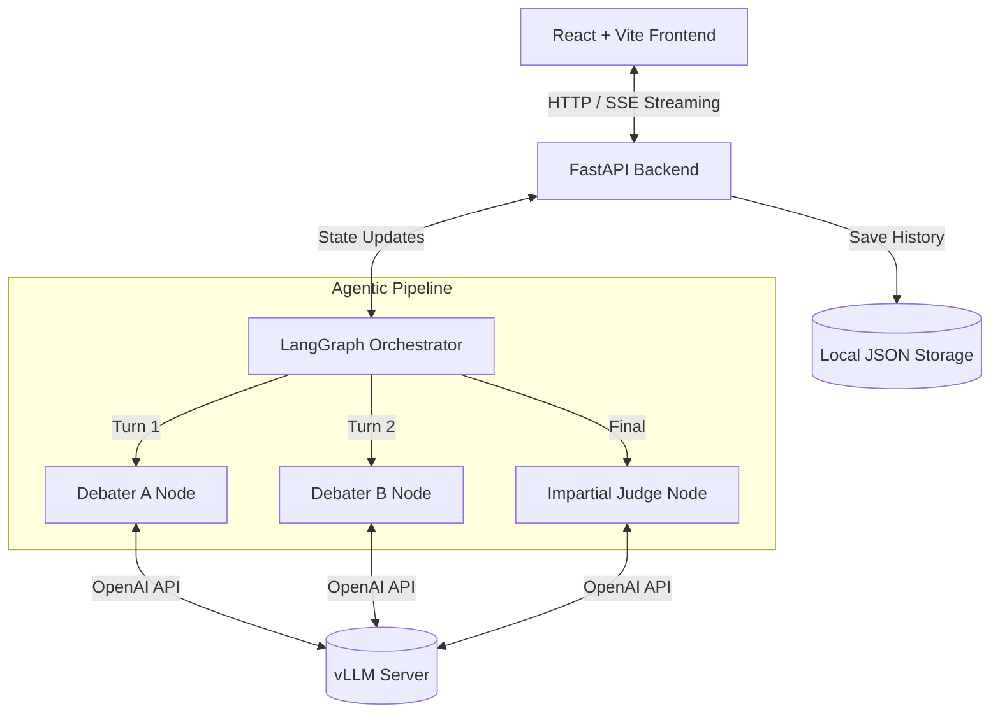
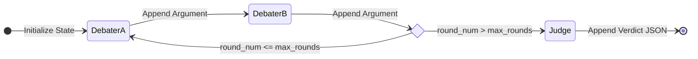

# 🤖 AI Debate Agent (v2.0)


A multi-agent AI system where two large language models autonomously debate any topic you give them, while a third impartial AI judge evaluates their logic, evidence, and persuasiveness.

Recently completely re-architected into a **production-ready SaaS application** featuring a modern React frontend and a FastAPI backend with Real-Time Server-Sent Events (SSE) streaming.

---

## 🏗️ High-Level Architecture

The system is separated into a strict Client-Server model.



---

## 🧠 Core Technologies Deep Dive

### 1. LangGraph Multi-Agent Orchestration
We use **LangGraph** to model the debate as a cyclical graph. Instead of passing strings back and forth, LangGraph manages a strongly typed `DebateState` dictionary containing the topic, the maximum rounds, the current round number, and the growing transcript of arguments.

**LangGraph Flow Diagram:**

- **Context Preservation:** Each agent node only receives the `DebateState`. It then dynamically formats the transcript into its system prompt before querying the LLM, ensuring perfect context preservation across rebuttals.
- **Dynamic Routing:** A conditional edge (`_route_after_b`) inspects the `round_num` in the state to determine whether to cycle back to Debater A or hand off to the Judge.

### 2. vLLM (High-Throughput Inference)
The application relies on **vLLM** hosted locally or remotely as the inference engine. 
- **OpenAI-Compatible:** We use the standard `openai` Python SDK to communicate with vLLM, making it trivial to swap in OpenAI, Groq, or Ollama if desired.
- **Streaming by Default:** The LLM responses are streamed chunk-by-chunk. These chunks are captured by a thread-safe Queue and immediately forwarded over the FastAPI SSE connection so the user sees the agents typing in real-time.

### 3. FastAPI & Real-Time SSE
The Python backend bridges LangGraph's synchronous graph execution to asynchronous HTTP streaming.
- `POST /api/debate/stream`: Accepts the topic and rounds. It spawns the LangGraph execution in a background thread and yields `Server-Sent Events` (SSE) directly to the React frontend.
- `GET /api/history` and `DELETE /api/history/{idx}`: Standard REST endpoints mapped to `storage.py` for persistent local state management.

### 4. React + Tailwind CSS UI
A completely custom-built Vite + React frontend replacing the old Gradio UI.
- **CSS Grid Layout:** A responsive 68/32 split screen layout ensuring the transcript and judge panels fit mathematically perfectly on the screen.
- **Rich Text Rendering:** Powered by `react-markdown` and `@tailwindcss/typography` to ensure bullet points, bolding, and italics generated by the LLM are rendered beautifully.
- **Strict State Boundaries:** A "View Only" mode prevents modifying past debates, while a hover-to-delete Trash icon enables precise history management.

---

## 🚀 Getting Started

### 1. Prerequisites
- Node.js (v18+)
- Python (3.10+)
- A running OpenAI-compatible API server (e.g., vLLM or Ollama).

### 2. Backend Setup
```bash
# Clone the repository
git clone https://github.com/Hetgandhi25/ai-debate-agent-vllm.git
cd ai-debate-agent-vllm

# Create a virtual environment
python -m venv venv
source venv/bin/activate  # On Windows: venv\Scriptsctivate

# Install Python dependencies
pip install -r requirements.txt

# Configure your LLM endpoint
cp .env.example .env
# Edit .env with your VLLM_BASE_URL, VLLM_API_KEY, and VLLM_MODEL

# Start the FastAPI server
uvicorn main:app --reload
```

### 3. Frontend Setup
Open a **new terminal window**:
```bash
cd ai-debate-agent-vllm/frontend

# Install Node dependencies
npm install

# Start the Vite development server
npm run dev
```

Navigate to `http://localhost:5173` in your browser to start using the AI Debate Agent!

---
*Built for the future of multi-agent interactions.*
